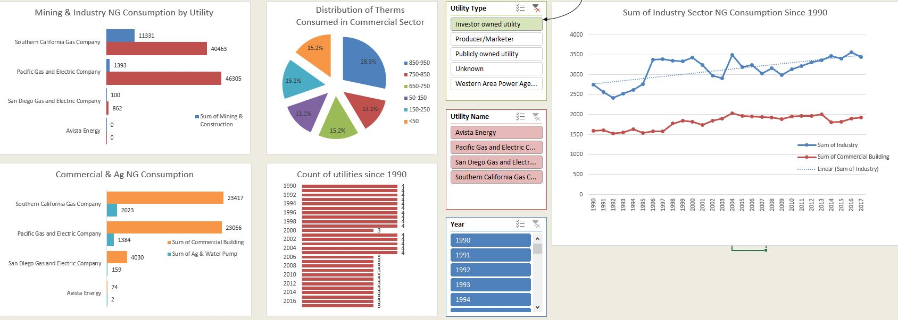

 

### The primary Module will display a chart for a specific utility that is selected in the drop down menu on the first tab. 

* This script will copy all the data for specific utility to a different tab and then chart that utilities gas consumption. 

### The "Start Here" dashboard allows the user to view an analysis of utility gas consumption at a glance

